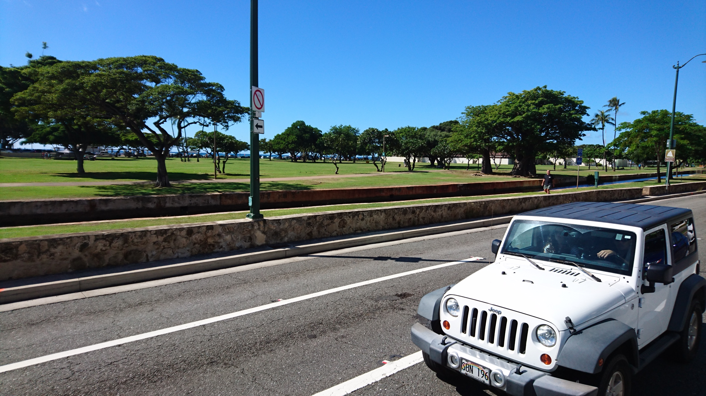
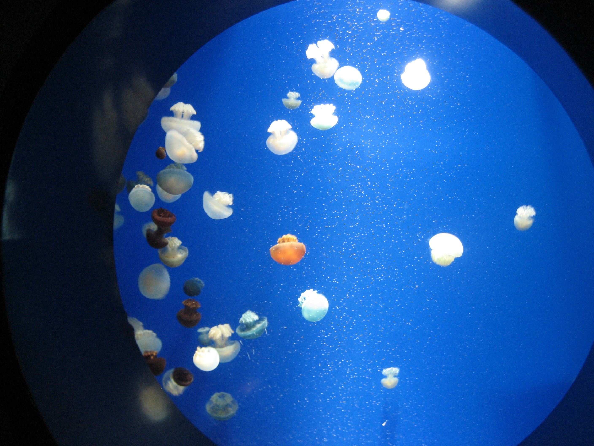

# 

<!DOCTYPE html>
<html lang="ja">
<head>

 <meta charset="UTF-8">
 <title>practice</title>

 
  

 <link rel="stylesheet" href="css/bootstrap.min.css">
 <link href="css/bootstrap.css" rel="stylesheet">
 <link href="style111.css" rel="stylesheet">
 <link href="css/plugins.css" rel="stylesheet">
 <link href="css/style2.css" rel="stylesheet">

 
  
  
 
 

</head>

<body>
 

<header class="header">
    

        <h1>Portforio</h1>
        <nav>
            <ul>
                <li><a href="#">トップページ</a></li>
                <li><a href="#">会社概要</a></li>
                <li><a href="#">事業内容</a></li>
                <li><a href="#">採用情報</a></li>
                <li><a href="#">お問い合わせ</a></li>
            </ul>
        </nav>
    

  </header>

  <table class="table">
   <tr>
   <td class="table-img" id="sidebar" ></td>

   <td class="table-img">
   

    <ol class="carousel-indicators">
      <li data-target="#carouselExampleIndicators" data-slide-to="0" class="active"></li>
      <li data-target="#carouselExampleIndicators" data-slide-to="1"></li>
      <li data-target="#carouselExampleIndicators" data-slide-to="2"></li>
    </ol>
    

      

        
          

      

        
          

      

        
         

    

    <a class="carousel-control-prev" href="#carouselExampleIndicators" role="button" data-slide="prev">
      
      Previous
    </a>
    <a class="carousel-control-next" href="#carouselExampleIndicators" role="button" data-slide="next">
      
      Next
    </a>
   

  </td>
</tr>
</table>
 

  
  
 

クライアント様の商品を広めるお手伝いをさせて頂きます

レスポンシブサイトにも対応いたします

   <section class="work">
    

    　<h2>事業内容</h2>
      <ul>
        <li><a href="#"><figure></figure><h3>タイトル</h3>
本文が入ります。本文が入ります。本文が入ります。本文が入ります。本文が入ります。
</a></li>
        <li><a href="#"><figure></figure><h3>タイトル</h3>
本文が入ります。本文が入ります。本文が入ります。本文が入ります。本文が入ります。本文が入ります。
</a></li>
        <li><a href="#"><figure></figure><h3>タイトル</h3>
本文が入ります。本文が入ります。本文が入ります。本文が入ります。
</a></li>
      </ul>
    

  </section>

  <!--l-footer-->
  <footer class="content-wrapper header-nav">
    <ul>
      <li><a href="#">© Copyright 2020</a></li>
      <li><a href="#">お問い合わせ</a></li>
     </ul>   
  </footer>
  <!-- /l-footer -->
</body>
</html>
